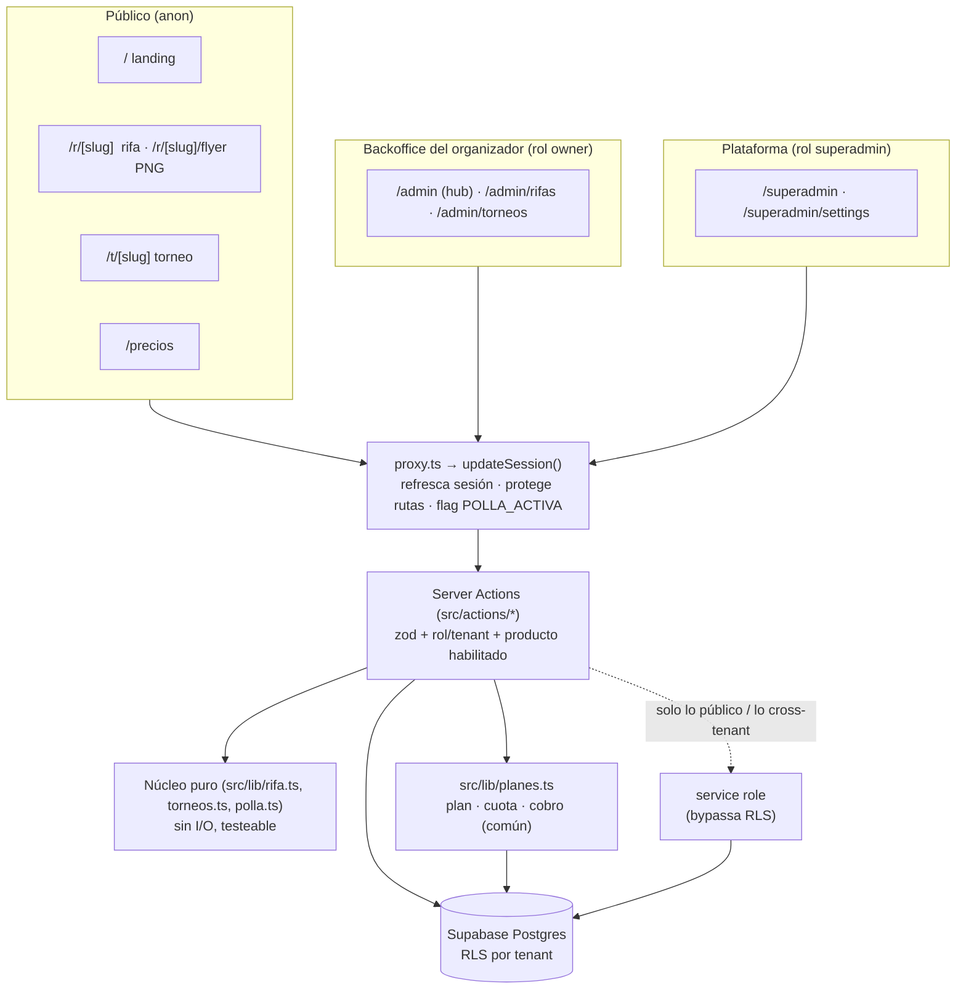

# Play Mundial — plataforma multi-tenant y multi-producto

Lo que nació como una **polla del Mundial** single-tenant es hoy una **plataforma
multi-tenant** con backoffice por organizador y panel de superadmin. Hoy corren
dos verticales sobre los mismos cimientos:

| Vertical | Estado | Rutas |
|---|---|---|
| **Rifas** | En producción | `/admin/rifas` · `/r/[slug]` |
| **Torneos deportivos** | MVP administrativo y financiero | `/admin/torneos` · `/t/[slug]` |
| Polla Mundial 2026 | Archivada tras `POLLA_ACTIVA`, sin borrar datos | `/jugar` · `/resultados` · `/comunidad` |

Cada organizador ve **solo las verticales que tenga habilitadas**
(`tenant_productos`); el superadmin las administra.

Este documento describe **la arquitectura real del repo hoy** y el **playbook
para montar nuevas verticales** sobre los mismos cimientos. El detalle de cada
una vive en [docs/plan-rifas.md](docs/plan-rifas.md) y
[docs/plan-torneos.md](docs/plan-torneos.md).

> ⚠️ **Next.js 16 tiene breaking changes** frente a lo que probablemente conoces.
> Antes de escribir código, lee `node_modules/next/dist/docs/` (así lo exige
> [AGENTS.md](AGENTS.md)). Gotchas ya confirmados en este repo:
> `cookies()` y `params` son **async**; `middleware.ts` se llama ahora
> [proxy.ts](proxy.ts); el botón de shadcn base-nova **no soporta `asChild`**
> (usa `buttonVariants()` o el prop `render`).

---

## 1. Stack

| Capa | Tecnología |
|---|---|
| Framework | Next.js **16.2** (App Router, RSC, Server Actions) + React 19 |
| Lenguaje | TypeScript estricto. Alias `@/*` → `src/*` |
| Datos / Auth | **Supabase**: Postgres + Auth + **RLS** + Realtime + Storage |
| UI | Tailwind v4 + shadcn **base-nova** (`@base-ui/react`), `lucide-react`, `sonner`, `next-themes` |
| Formularios | `react-hook-form` + `zod` v4 |
| Otros | `next/og` (flyer PNG), `web-push` (notificaciones), `xlsx` (export), `date-fns` |
| Deploy | Vercel (cron en [vercel.json](vercel.json)) |

Estructura: **`app/` en la raíz** (rutas) y **`src/`** (todo el código no-ruta:
`actions/`, `components/`, `lib/`, `types/`).

---

## 2. Arquitectura



### Reglas de la capa de acceso

1. **Dos clientes de Supabase** ([src/lib/supabase/server.ts](src/lib/supabase/server.ts)):
   - `createClient()` → respeta la sesión y por tanto la **RLS**. Es el default.
   - `createServiceRoleClient()` → **bypassa RLS**. Se usa solo para (a) lo
     público anónimo, que debe devolver un *corte seguro* de datos, y (b)
     operaciones cross-tenant del superadmin (crear organizadores, reasignar).
2. **Las Server Actions validan permisos por su cuenta.** El proxy es apenas la
   primera barrera (¿hay sesión?); el rol y el tenant se comprueban dentro de
   cada action con los helpers de [src/lib/auth.ts](src/lib/auth.ts).
3. **La lógica de negocio vive en núcleos puros** sin I/O
   ([src/lib/rifa.ts](src/lib/rifa.ts): `resolverGanadores`, `calcularDashboard`,
   `cifrasDeResultado`, `enmascararNombre`). Las actions orquestan; el núcleo decide.
4. **Toda action devuelve `ActionResult<T>`** (`{ success: true, data }` |
   `{ success: false, error }`), nunca lanza al cliente.
5. **Entrada validada con zod** en el borde de cada action.

### Mapa de rutas

| Ruta | Acceso | Qué es |
|---|---|---|
| `/` | público | Landing de la vertical Rifas ([rifas-landing.tsx](src/components/rifas-landing.tsx)). Con `POLLA_ACTIVA=true` vuelve a ser el home del Mundial |
| `/precios` | público | Planes; **lee precios de `plataforma_config`**, no hardcodeados |
| `/r/[slug]` | público | Página de la rifa: grilla libre/ocupado, reserva sin cuenta, ganadores enmascarados |
| `/r/[slug]/flyer` | público | PNG dinámico para redes (`next/og`) con el estado real de la grilla |
| `/r/[slug]/opengraph-image` | público | OG image |
| `/t/[slug]` | público | Landing del torneo: cupos en vivo, inscripción sin cuenta, premiación, cómo pagar |
| `/terminos` | público | Términos y tratamiento de datos |
| `/admin/login` | público | Login + **registro self-service** de organizador |
| `/admin` | owner | Hub del backoffice; muestra **solo los productos habilitados** |
| `/admin/rifas`, `/nueva`, `/[id]`, `/[id]/editar` | owner | CRUD, grilla, panel financiero, sorteo, pagos |
| `/admin/torneos`, `/nuevo`, `/[id]`, `/[id]/editar` | owner | CRUD, equipos, inscripciones, gastos, rentabilidad |
| `/superadmin` | superadmin | Organizadores, dashboard por mes, cobros pendientes |
| `/superadmin/settings` | superadmin | Precios, reglas del free, datos de cobro de la plataforma |
| `/api/sync`, `/api/live` | cron / público | Sincronización y feed en vivo del Mundial (no-op si `POLLA_ACTIVA≠true`) |
| `/jugar`, `/resultados`, `/comunidad`, `/partidos/[id]`, `/equipos/[nombre]` | público | **Vertical Mundial archivada**; el proxy las redirige a `/` mientras `POLLA_ACTIVA≠true` |

---

## 3. Multi-tenancy: el corazón de la plataforma

### Modelo

```
auth.users ──< memberships >── tenants ──< rifas   ──< premios
                  │ rol         │  plan   │         └< boletas ──< ganadores
                  │             │         ├──< torneos ──< equipos_torneo
                  │             │         │             ├< premios_torneo
                  │             │         │             └< gastos_torneo
                  │             │         ├─ tenant_pago_config
           superadmin|owner     │         └──< tenant_productos
                                └──< cobros (producto: rifas | torneos)
```

- **`tenants`** — el organizador. `nombre`, `slug`, `estado` (`activo` |
  `archivado`), `plan_actual`, `suscripcion_vence_at`.
- **`memberships`** — `auth.users` ↔ `tenants` con `rol` (`superadmin` | `owner`).
  Único por `(user_id, tenant_id)`.
- **`tenant_productos`** — qué verticales tiene habilitadas cada organizador.
  Único por `(tenant_id, producto)`. Lo administra el superadmin.
- **`tenant_pago_config`** — datos de cobro **de cada organizador** (cuenta, llave
  Bre-B, QR, WhatsApp). Sustituyó al `POLLA.banco` global y hardcodeado.
- **`plataforma_config` / `plataforma_pago_config`** — fila única; precios, reglas
  del free y la cuenta a la que los organizadores le pagan **a la plataforma**.

Todas las tablas del dominio llevan **`tenant_id`** (incluidas las `boletas`, para
que la RLS no tenga que hacer joins).

### Aislamiento (RLS)

Dos funciones `SECURITY DEFINER` definidas en
[20260720000000_tenancy.sql](supabase/migrations/20260720000000_tenancy.sql) son
la base de **todas** las políticas:

```sql
public.es_superadmin()      -- ¿el usuario tiene alguna membership rol=superadmin?
public.es_miembro(t uuid)   -- es_superadmin() OR tiene membership en el tenant t
```

Y el patrón por tabla se repite igual en todo el esquema:

```sql
-- 1. El miembro (y el superadmin) hacen todo dentro de su tenant
create policy "<tabla>_tenant_rw" on public.<tabla> for all to authenticated
  using (public.es_miembro(tenant_id)) with check (public.es_miembro(tenant_id));

-- 2. El público lee solo lo que ya es visible
create policy "<tabla>_public_select" on public.<tabla> for select to anon
  using (estado in ('activa','cerrada','sorteada','pagada'));

-- 3. Lo que sólo el dueño de la plataforma puede tocar
create policy "<tabla>_super_write" on public.<tabla> for all to authenticated
  using (public.es_superadmin()) with check (public.es_superadmin());
```

**Excepciones deliberadas:** `boletas`, `equipos_torneo` y `gastos_torneo`
**no tienen política `anon`**. Contienen nombres, teléfonos, correos y dinero, y
la anon key es pública. Todo lo público (pintar la grilla, reservar, inscribir un
equipo) pasa por Server Actions con service role que devuelven cortes seguros:
`BoletaPublica` (`numero` + `ocupado:boolean`) y `EquipoTorneoPublico`
(`id`, `nombre`, `escudo_url`, `confirmado`). Así el público **nunca** distingue
`reservado` de `pagado` ni ve quién debe la inscripción: eso es información
interna del organizador.

### Productos habilitados por tenant

`tenant_productos` decide qué verticales ve cada organizador. El gating vive en
**tres capas, no una**:

1. **UI** — el hub `/admin` solo pinta las tarjetas habilitadas.
2. **Ruta** — cada página valida el producto antes de renderizar.
3. **Server Action** — el guard `accesoTorneos()` revalida sesión, membresía y
   producto. Los docs de Next 16 lo dicen explícito: *«Server Functions son
   alcanzables por POST directo, no solo a través de la UI»*. Ocultar una
   tarjeta no es seguridad.

El superadmin pasa siempre: administra la plataforma aunque su propio tenant no
tenga la vertical activada. Compatibilidad: un tenant sin fila conserva `rifas`
por defecto (`PRODUCTOS_POR_DEFECTO` en [src/lib/productos.ts](src/lib/productos.ts)),
para que nadie pierda acceso a lo que ya estaba vendiendo.

### Privacidad (invariantes que no se negocian)

- Nombres enmascarados en vistas públicas (`Di**** Cu***`, `enmascararNombre`).
- Jamás teléfono, monto, estado de pago ni identidad en `/r/[slug]` ni en el flyer.
- Consentimiento explícito de tratamiento de datos al reservar.

---

## 4. Monetización (ya implementada, común a todas las verticales)

- **Precios y reglas del free NO están en el código**: viven en
  `plataforma_config` y los edita el superadmin en `/superadmin/settings`.
- **Un solo servicio decide** ([src/lib/planes.ts](src/lib/planes.ts),
  `resolverActivacion`), en este orden:
  *(1)* ¿suscripción vigente? → activa; *(2)* ¿cabe en la capa gratuita (tamaño
  y cuota)? → activa como `gratis`; *(3)* si no, **inserta un `cobro` pendiente y
  deja la entidad en `borrador`**. El organizador transfiere y el superadmin
  ejecuta `confirmarCobro()`, que activa la entidad o extiende la suscripción.
- Lo único que cambia por vertical es la **tabla de reglas** de ese servicio:

  | | Unidad de tamaño | Escalones | Tope del free |
  |---|---|---|---|
  | Rifas | números | ≤100 · ≤500 · ≤1000 | `free_max_numeros` |
  | Torneos | cupo de equipos | ≤8 · ≤16 · ≤32 · más | `free_max_equipos` |

- **Suscripción mensual** — mientras `suscripcion_vence_at` esté vigente, activar
  es gratis e ilimitado en cualquier vertical.
- El ledger `cobros` (`tenant_id`, **`producto`**, `rifa_id`/`torneo_id`, `tipo`,
  `monto`, `estado`, `periodo`, `comprobante`) es la fuente de verdad del dinero
  de plataforma.

> La cuota se valida **en el server action**, no sólo en la UI. Cualquier vertical
> nueva debe pasar por `resolverActivacion` y no reimplementarla.

Lógica en [src/lib/planes.ts](src/lib/planes.ts),
[src/actions/rifas.ts](src/actions/rifas.ts) (`activarRifa`),
[src/actions/torneos.ts](src/actions/torneos.ts) (`activarTorneo`) y
[src/actions/cobros.ts](src/actions/cobros.ts).

---

## 5. Puesta en marcha

```bash
npm install
cp .env.example .env.local        # completa Supabase, POLLA_ACTIVA, etc.
npm run migrate                   # aplica supabase/migrations/*.sql en orden (idempotente)
npm run seed:superadmin           # crea el usuario superadmin + su tenant + membership
npm run dev                       # http://localhost:3000
```

| Script | Qué hace |
|---|---|
| `npm run dev` / `build` / `start` | Next.js |
| `npm run lint` | ESLint |
| `npm run migrate` | [scripts/migrate.sh](scripts/migrate.sh) — corre todas las migraciones vía `psql` (usa el **pooler** de Supabase, no la conexión directa) |
| `npm run seed:superadmin` | [scripts/seed-superadmin.mjs](scripts/seed-superadmin.mjs) |

**Variables clave** (ver [.env.example](.env.example) para la lista completa):

| Variable | Para qué |
|---|---|
| `NEXT_PUBLIC_SUPABASE_URL` / `_ANON_KEY` | Cliente con RLS |
| `SUPABASE_SERVICE_ROLE_KEY` | Cliente admin — **solo servidor**, nunca al bundle |
| `SUPABASE_DB_HOST` / `_PORT` / `_USER` / `_PASSWORD` | Migraciones |
| `POLLA_ACTIVA` | `true` reactiva la vertical Mundial; cualquier otro valor la oculta |
| `CRON_SECRET` | Protege `/api/sync` |
| `NEXT_PUBLIC_VAPID_PUBLIC_KEY` / `VAPID_PRIVATE_KEY` | Web push |
| `FUTBOL_PROVIDER`, `FOOTBALL_DATA_*`, `FLASHSCORE_*` | Datos deportivos (solo Mundial) |

**Migraciones**: SQL plano en `supabase/migrations/`, nombradas
`YYYYMMDDHHMMSS_tema.sql` y **siempre idempotentes** (`create table if not
exists`, `drop policy if exists` antes de `create policy`, `do $$ ... end $$`
para los enums). Se pueden re-ejecutar todas sin romper nada.

---

## 6. Convenciones del código

- **Todo en español**: nombres de tablas, columnas, tipos, funciones y comentarios.
- Tipos del dominio a mano en [src/types/index.ts](src/types/index.ts), espejando
  el esquema SQL. Para cada entidad interna existe su **corte público**
  (`Apuesta`/`ApuestaCliente`, `Boleta`/`BoletaPublica`, `Ganador`/`GanadorPublico`).
- Componentes: RSC por defecto; `"use client"` solo donde hay interacción.
  Los `loading.tsx` usan skeletons ([skeletons.tsx](src/components/rifa/skeletons.tsx)).
- Un archivo de actions por dominio; `revalidatePath()` tras cada mutación.
- Al diseñar cualquier pantalla pública o de venta, se usa la skill
  **`brand-ux-ventas`** (prioridad: confianza → conversión → difusión).
- Plan y estado detallado de la vertical actual: [docs/plan-rifas.md](docs/plan-rifas.md).

---

## 7. Cómo agregar una nueva vertical de negocio

Los cimientos (tenancy, roles, RLS, planes, ledger de cobros, backoffice,
superadmin) **son agnósticos del producto**. Agregar una vertical es repetir un
patrón de 9 pasos, no rearmar la plataforma. La vertical de torneos se construyó
exactamente así: sirve de referencia viva.

### 7.1 Generalizaciones ya hechas (al llegar la 2ª vertical)

Estos tres puntos estaban acoplados a "rifas" y se resolvieron antes de escribir
la vertical de torneos, para no duplicar código:

| Qué estaba acoplado | Cómo quedó |
|---|---|
| La cuota gratis contaba filas de `rifas` dentro de `activarRifa` | `resolverActivacion({ tenantId, producto, entidadId, tamano })` en [src/lib/planes.ts](src/lib/planes.ts), con una tabla de reglas por producto. `activarRifa` y `activarTorneo` son envoltorios delgados |
| El ledger solo apuntaba a `rifa_id` | `cobros.producto` + `cobros.torneo_id`; `confirmarCobro()` activa la entidad que corresponda |
| Precios solo de rifa | `plataforma_config` suma los escalones de torneo y sus reglas de free, editables en `/superadmin/settings` |
| Qué productos ve cada tenant: no existía | Tabla `tenant_productos` + helpers + gating en UI, ruta y action |

**Sigue pendiente** (no bloquea, pero se vuelve caro): un usuario está atado a
**un tenant y un rol** — [`getMembership()`](src/lib/auth.ts) toma la primera
membresía y `rol_membership` solo tiene `superadmin`/`owner`. En cuanto un
organizador necesite equipo, hay que añadir `staff` al enum y un selector de
tenant activo.

### 7.2 El patrón, paso a paso

1. **Migración** `supabase/migrations/<ts>_<vertical>.sql`, idempotente. Enums con
   `do $$ ... end $$`; **`tenant_id not null references tenants(id) on delete
   cascade` en cada tabla**; `slug_publico text unique` si hay página pública;
   un índice único que impida el doble-booking del recurso escaso (el equivalente
   a `unique (rifa_id, numero)`).
2. **RLS** con los tres policies del patrón (`_tenant_rw`, `_public_select`,
   `_super_write`) usando `es_miembro()` / `es_superadmin()`. **Nunca des `select`
   a `anon` sobre una tabla con datos personales**: expón un corte seguro desde
   una action con service role, o una vista con columnas recortadas.
3. **Producto**: añade el id al `check` de `tenant_productos`, al tipo
   `ProductoPlataforma` y al catálogo de
   [src/lib/productos-ui.ts](src/lib/productos-ui.ts).
4. **Tipos** en `src/types/index.ts`: la entidad + su corte público.
5. **Núcleo puro** `src/lib/<vertical>.ts`: sin I/O, sin Supabase. Ahí van las
   reglas del negocio y las métricas del dashboard.
6. **Server Actions** `src/actions/<vertical>.ts`: un guard que valide sesión +
   membresía + producto habilitado, zod en el borde, `ActionResult<T>` de salida,
   `revalidatePath()` al mutar.
7. **Monetización**: añade la fila del producto a `REGLAS` en `src/lib/planes.ts`
   y haz que la action que *publica* llame a `resolverActivacion`. Nada se activa
   sin pasar por ahí.
8. **Rutas**: `app/admin/<vertical>/**` (owner) + `app/<letra>/[slug]/**`
   (público) + tarjeta en el hub `/admin`, enlace en `backoffice-header.tsx`,
   `bottom-nav.tsx` y opción en `nuevo-menu.tsx`.
   Página pública = **embudo**, no planilla: promesa arriba, escasez real, CTA
   único, compartir prominente, y un `flyer/route.tsx` con `next/og` si aplica.
9. **Superadmin**: si la vertical mueve dinero, súmala al dashboard de
   `/superadmin` y a los cobros; si tiene precios, a `/superadmin/settings`.

---

## 8. Vertical "Torneos deportivos" (implementada)

El caso que motivó volver la plataforma multi-producto. Detalle completo en
[docs/plan-torneos.md](docs/plan-torneos.md); aquí, el mapa.

**Producto:** un organizador crea campeonatos de cualquier deporte (fútbol,
voleibol, voleiplaya, baloncesto, pádel…), cobra inscripciones, controla gastos
y sabe **si el torneo deja utilidad**. El fixture es la siguiente fase.

### 8.1 Tablas

| Tabla | Rol | Acceso `anon` |
|---|---|---|
| `torneos` | Configuración, ciclo de vida y monetización | Lectura en `inscripciones`/`programado`/`en_curso`/`finalizado` |
| `premios_torneo` | Premiación **por puesto** (1° campeón, 2° subcampeón…) | Lectura de torneos ya visibles |
| `equipos_torneo` | El recurso escaso (≈ boletas). Responsable, estado, pagos | **Ninguno** |
| `gastos_torneo` | Cancha, arbitraje, premiación… define la rentabilidad | **Ninguno** |

La premiación es una **lista ordenada**, no un texto libre: cada torneo premia
los puestos que quiera (solo el campeón, los dos primeros, los cuatro…), cada
premio es dinero o producto, y el backoffice renumera los puestos al guardar
para que nunca queden huecos. Eso permite pintarla como podio en la landing,
sumar cuánto cuesta en dinero y avisar si no está respaldada por un gasto.

Ciclo: `borrador` → `inscripciones` → `programado` → `en_curso` → `finalizado`
| `cancelado`. `unique (torneo_id, nombre)` evita inscribir dos veces el mismo
equipo, igual que `unique (rifa_id, numero)` en rifas.

### 8.2 Núcleo puro — [src/lib/torneos.ts](src/lib/torneos.ts)

Sin I/O, testeable: `calcularIngresosTorneo`, `calcularGastosTorneo`,
`calcularDashboardTorneo`, `calcularPuntoEquilibrio` (redondea hacia arriba,
`null` si la inscripción es gratuita), `valorPremiacion` y
`validarViabilidadTorneo`, que traduce los números a decisiones:

> «Necesitas 3 equipos adicionales para llegar al punto de equilibrio»
> «El torneo genera una pérdida proyectada de $250.000 aun con el cupo lleno»
> «Quedan 2 cupos disponibles»
> «La premiación en dinero suma $1.400.000 y solo tienes $400.000 registrado como gasto: la utilidad proyectada está optimista»

La hora entra por parámetro (`ahora`) para poder probar las alertas sin depender
del reloj.

### 8.3 Backoffice y página pública

- `/admin/torneos` — lista con buscador, filtro por estado y, por torneo,
  equipos / ingresos esperados / utilidad proyectada.
- `/admin/torneos/[id]` — pestañas **Resumen · Equipos · Finanzas ·
  Configuración**, más **Fixture y resultados** visible y deshabilitada
  (*Próximamente*). Permite registrar equipos, confirmarlos o rechazarlos,
  cobrar (incluye abonos parciales), escribirle al responsable por WhatsApp y
  llevar los gastos.
- `/t/[slug]` — embudo público: promesa y premiación arriba, escasez real
  (barra de cupos), inscripción sin cuenta en un paso, cómo pagar, equipos ya
  inscritos como prueba social y botón de compartir. Los metadatos OG llevan el
  premio del campeón: es lo que engancha en la vista previa de WhatsApp.

**La inscripción pública nunca confirma ni cobra sola**: entra como solicitud
`pendiente` y el organizador decide. El mensaje al terminar lo dice explícito.

### 8.4 Monetización

Sin tablas nuevas: `cobros.producto = "torneos"` + `cobros.torneo_id`, y los
escalones por cupo de equipos (≤8 / ≤16 / ≤32 / más) en `plataforma_config`.
`activarTorneo` usa el mismo `resolverActivacion` que las rifas. **Los montos
nacen en 0**: los fija el superadmin.

### 8.5 Lo que falta en torneos

- **Fixture y resultados** (pestaña ya visible, deshabilitada). Reutilizará el
  enum `public.estado_partido` del Mundial. Riesgos a validar antes: doble-booking
  de cancha/horario, reprogramaciones en cascada y desempates configurables.
- Planilla de jugadores, carnet y sanciones.
- Flyer PNG del torneo (clonar el de rifas con `next/og`) y export xlsx.

---

## 9. Deuda técnica conocida

- `/r/[slug]` refresca por **polling (20s) + al enfocar**, no por Realtime directo:
  `boletas` tiene datos personales y no se expone al `anon`. Si se necesita
  tiempo real, el camino es una **vista recortada** con Realtime propio.
- `getMembership()` asume **un tenant por usuario** (toma la primera membresía) y
  el enum de roles solo tiene `superadmin`/`owner`: falta `staff`.
- El dashboard de `/superadmin` cuenta **solo rifas**; falta sumar torneos a las
  métricas del mes.
- `/precios` habla solo de rifas: se actualiza cuando haya montos de torneo.
- El header y la barra inferior listan todas las verticales; el gating real está
  en el hub `/admin`, en las rutas y en las actions. Un tenant sin el producto ve
  el enlace y recibe un mensaje claro al entrar.
- La vertical Mundial sigue en el repo tras `POLLA_ACTIVA`; sus rutas, crons y
  proveedores externos quedan inertes, pero el código está vivo y es reutilizable.
- Los tipos de `src/types/index.ts` se mantienen **a mano**; migrar a
  `supabase gen types typescript --linked` cuando el esquema se estabilice.
- Export xlsx del dashboard: la dependencia está, el botón todavía no en todas
  las pantallas.
